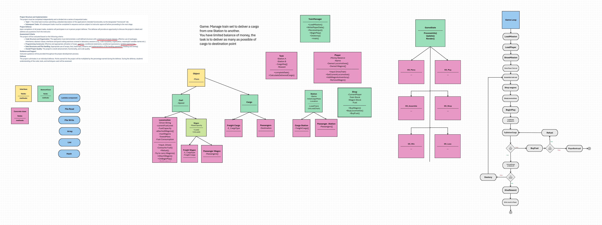

# Train Mananger

Small project for Java subject in WSB-NLU
##Project Class and sequence diagram

Prerequisites:
- JDK 11 or later installed and `javac`/`java` available on PATH.

Build:
- Run `build.bat` on Windows to compile: `build.bat`
Run:
- Run `run.bat` to execute: `run.bat`

